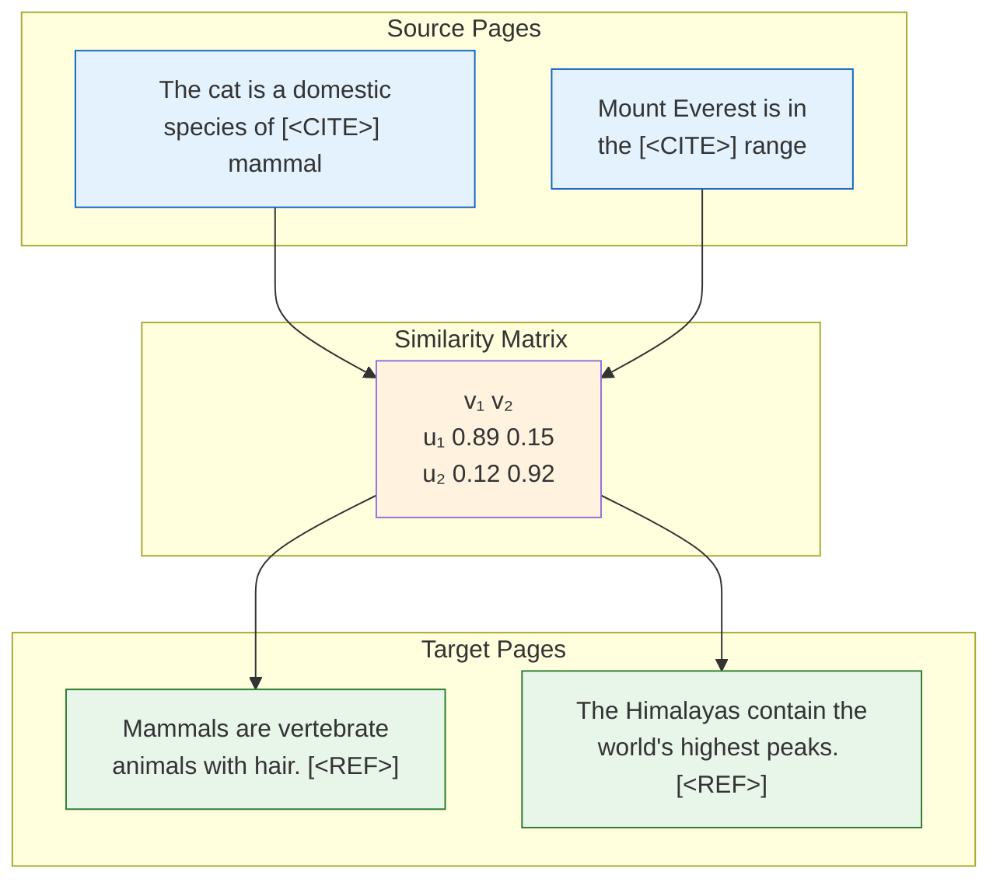

# Citation Matcher

This repository contains a deep learning model for matching citations in Wikipedia articles. The system learns to identify and link appropriate citations by understanding the context in which they appear and the content of the cited articles. The main idea is to implement this as a retrieval: we want the model to be able to embed the citing page (with the text of citation masked) and the target in a vector space, such that these vectors are close. Thus, given a page with a reference masked, we can retrieve pages that are likely to be at that location. 

## Predicting citations as a retrieval problem
- Data processing
  - Processes Wikipedia XML dumps efficiently
  - Extracts and cleans article content and citations
  - For each reference, creating a pair of source (citing page) and target (cited page) pages
  - After pre-processing, it can store it in JSONL and SQLite storage formats
- Language modeling
  - Define a special token for citation `<CITE>` which replaces and masks the reference in source, and for a refernece `<REF>`, which is added to the ened of target page
  - Implements a language model based citation matching, that learns to make embedding of matching <CITE> and <REF> tokens as close as possible.
- Evaluation:
  - We treat this as a retrieval problem: Given a validation set of $n$ source and target pairs, we compute $n$ source and $N$ target vectors, normalize them, and compute their pairwise inner products, and then compute the cross entropy loss, assuming that for the row $i$, the correct label is $i$.
  - Metrics:
    - Top-k accuracy: the recall of finding the right target, if we look at the first $k$ closest vectors
    - Mean Reciprocal Rank: the mean value of $\frac1N \sum_i 1/r_i$ where, where $r_i$ is the rank of the true target for source $i$

