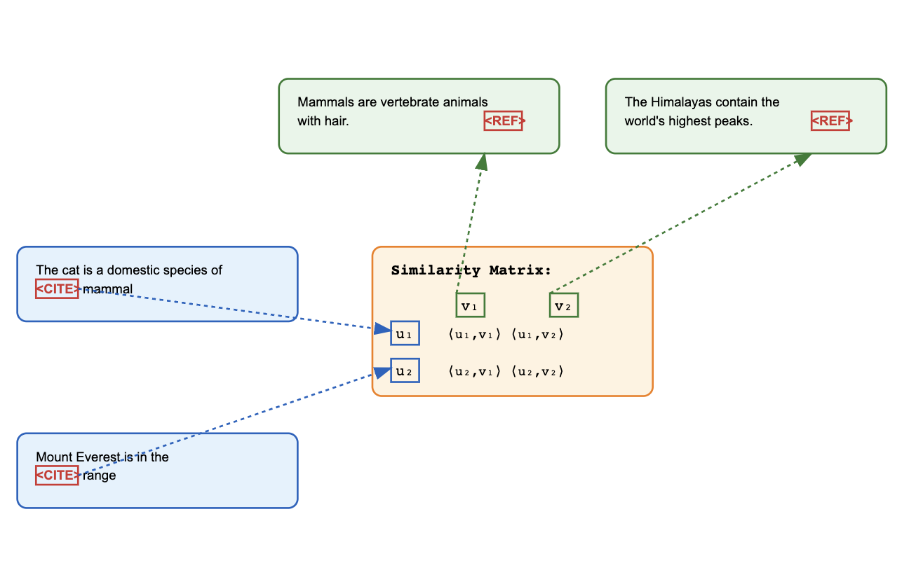

# CiTER: Contrast*i*ve Text Embeddings for Retrieval

This project aims to use language models to predict and understand relationships between documents through citations and references, by learning abstract representations of documents to identify relevant citations and references across different types of content including academic papers, wiki articles, and technical documents. We want the model to be able to embed the citing page (with the text of citation masked) and the target in a vector space, such that these vectors are close. Thus, given a page with a reference masked, we can retrieve pages that are likely to be at that location. 

## Project structure  
```
├── config.py           # The configuration parametrs
├── wiki_processor.py  # Wikipedia dump reader data citation extraction
├── data_processing.py  # Data preparation and processing for tokenization
├── model.py           # Core model architecture definition
├── trainer.py        # Training orchestration and management
└── train.py          # Training script entry point
├── test.ipynb         # Testing and demonstration notebook using out of describution data 
```

### Module Descriptions

- **config.py**: Manages all configuration parameters including model settings, training hyperparameters, and directory structures. Uses dataclasses for type-safe configuration handling and supports YAML serialization.

- **data_processing.py**: Contains utilities for preparing and processing citation data for training. Handles tokenization, batch creation, and dataset management.

- **model.py**: Defines the core CiteBrain model architecture. Implements a custom transformer-based model for citation matching using document embeddings.

- **test.ipynb**: Jupyter notebook for testing model functionality and demonstrating usage examples.

- **train.py**: Main entry point for training the model. Sets up configuration and initiates the training process.

- **trainer.py**: Implements the training loop, validation, checkpoint management, and metrics tracking. Integrates with Weights & Biases for experiment tracking.

- **wiki_processor.py**: Handles Wikipedia dump processing, article extraction, and citation parsing. Supports both JSONL and SQLite storage formats.

## Usage

 **Setup Configuration**:
   ```python
   from config import TrainingConfig
  from trainer import TrainingManager

   
   config = TrainingConfig(
       project_name="citation-matching",
       model_name="bert-base-uncased",
       batch_size=280,
       learning_rate=1.5e-4
   )

  trainer = TrainingManager(config)
  results = trainer.get_results()
  trained_model = trainer.train_citation_matcher(results)
   ```

  And to resume training from a saved checkpoint:
  
  ```python
  config.resume_from = '/path/to/checkpoint.pt'
  trainer = TrainingManager(config)
  trained_model = trainer.train_citation_matcher(results)
  ```

## Illustration of the main idea 
Illustration of the main idea:   



